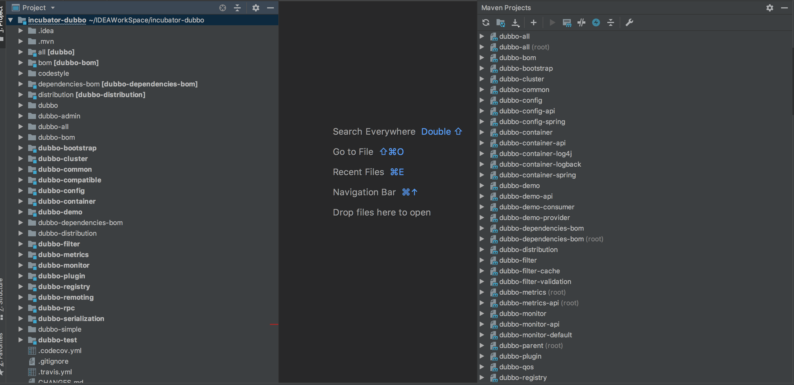

你好，Dubbo，初次见面，我想和你交个朋友。

Dubbo 你到底是什么？
先给出一套官方的说法：Apache Dubbo 是一款高性能、轻量级基于 Java 的 RPC 开源框架。

那么什么是 RPC？
背景
随着互联网的发展，网站应用的规模不断扩大，常规的垂直应用架构已无法应对，分布式服务架构以及流动计算架构势在必行，亟需一个治理系统确保架构有条不紊的演进。

单一应用架构
当网站流量很小时，只需一个应用，将所有功能都部署在一起，以减少部署的节点和成本。
此时，用于简化增删改查工作量的数据访问框架(ORM)是关键。
垂直应用架构
当访问量逐渐增大，单一应用增加机器带来的加速度越来越小，提升效率的方法之一是将应用拆成互不相干的几个应用，以提升效率。
此时，用于加速前端页面开发的 Web 框架(MVC)是关键。
分布式服务架构
当垂直应用越来越多，应用之间交互不可避免，将核心业务抽取出来，作为独立的服务，逐渐形成稳定的服务中心，使前端应用能更快速的响应多变的市场需求。
此时，用于提高业务复用及整合的分布式服务框架(RPC)是关键。
流动计算架构
当服务越来越多，容量的评估，小服务资源的浪费等问题逐渐显现，此时需增加一个调度中心基于访问压力实时管理集群容量，提高集群利用率。
此时，用于提高机器利用率的资源调度和治理中心(SOA)是关键。

文档简短形象的对单一应用架构、垂直应用架构、分布式服务架构、流动计算架构做了一个对比，可以很明白的看出这四个架构所适用的场景，因为业务需求越来越复杂，才会有这一系列的演变。
RPC 英文全名为 Remote Procedure Call，也叫远程过程调用，其实就是一个计算机通信协议，它是一种通过网络从远程计算机程序上请求服务，而不需要了解底层网络技术的协议。
计算机通信协议有很多种，对于开发来说，最熟悉的应该是 HTTP 协议，我这里就做个简单的比较，HTTP 协议是属于应用层的，而 RPC 跨越了传输层和应用层。
HTTP 本身的三次握手协议，每发送一次请求，都会有一次建立连接的过程，就会带来一定的延迟，并且 HTTP 本身的报文庞大，而 RPC 可以按需连接，调用结束后就断掉，也可以是长链接，多个远程过程调用共享同一个链接，可以看出来 RPC 的效率要高于 HTTP，但是相对于开发简单快速的 HTTP 服务，RPC 服务就会显得复杂一些。
回到原先的话题，继续来聊聊 Dubbo。
关于 Dubbo 的特点分别有连通性、健壮性、伸缩性、以及面向未来架构的升级性。
因为接下来需要对 Dubbo 各个模块的源码以及原理进行解析，所以先介绍一下 Dubbo 的源码库，Dubbo 框架目前已经交由 Apache 基金会进行孵化，被挂在 Github。
然后讲一下 Dubbo 的版本策略：两个大版本并行发展，2.5.x 是稳定版本、2.6.x 是新功能的实验版本。
等 2.6.x 上的实验都稳定了以后，会迁移到 2.5.x，所以如果你想了解 Dubbo 最新的牛逼特性，就选择 2.6.x，否则可以选用 2.5.x 版本。
我接下来的介绍都是基于 2.6.x 版本。

Dubbo 框架设计介绍
Dubbo 的官方文档真的写的太好了，我在这里还是要夸赞一下。
接下来我对整个框架设计的介绍是基于官方文档的基础上进行扩充，尽量做到更加通俗易懂。
我们先来看看把源码 Clone 下来后的结构：

可以看到 Dubbo 被拆分成很多的 Maven 项目(右边的我还没有截全)。
如果看过 Dubbo 官方文档的朋友肯定看到过以下这个图：

从以上这个图我们可以清晰的看到各个模块之间依赖关系，其实以上的图只是展示了关键的模块依赖关系，下面我会对各个模块做个简单的介绍，至少弄明白各个模块的作用。
先来讲讲上图的几个模块：
1.dubbo-registry(注册中心模块)
  官方解释：基于注册中心下发地址的集群方式，以及对各种注册中心的抽象。
  我的理解：Dubbo 的注册中心实现有 Multicast、Zookeeper、Redis、Simple，这个模块就是封装了 Dubbo 所支持的注册中心的实现。
  看看 dubbo-registry 目录结构：
  dubbo-registry
  -->dubbo-registry-api
  -->dubbo-registry-consul
  -->dubbo-registry-default
  -->dubbo-registry-etcd3
  -->dubbo-registry-eureka
  -->dubbo-registry-multicast
  -->dubbo-registry-multiple
  -->dubbo-registry-nacos
  -->dubbo-registry-redis
  -->dubbo-registry-sofa
  -->dubbo-registry-zookeeper
  1.1.dubbo-registry-api：抽象了注册中心的注册和发现，实现了一些公用的方法，让子类只关注部分关键方法。
  1.2.以下其他包分别是注册中心实现方法的封装，其中 dubbo-registry-default 就是官方文档里面的 Simple。
2.dubbo-cluster(集群模块)
  官方解释：将多个服务提供方伪装为一个提供方，包括负载均衡、容错、路由等，集群的地址列表可以是静态配置的，也可以是由注册中心下发。
  我的理解：它就是一个解决出错情况采用的策略，这个模块里面封装了多种策略的实现方法，并且也支持自己扩展集群容错策略，dubbo-cluster 把多个 Invoker 伪装成一个 Invoker，并且在伪装过程中加入了容错逻辑，失败了，重试下一个。
  看看 dubbo-cluster 目录结构：
  org.apache.dubbo.rpc.cluster
  -->configurator
  -->directory
  -->loadbalance
  -->merger
  -->router
  -->support
  2.1.configurator 包：配置包，Dubbo 的基本设计原则是采用 URL 作为配置信息的统一格式，所有拓展点都通过传递 URL 携带配置信息，这个包就是用来根据统一的配置规则生成配置信息。
  2.2.directory 包：封装了把多个 Invoker 伪装成一个 Invoker 的方法，Directory 代表了多个 Invoker，这里介绍一下 Invoker，Invoker 是 Provider 的一个调用 Service 的抽象，Invoker 封装了 Provider 地址以及 Service 接口信息。
  2.3.loadbalance 包：封装了负载均衡的实现，负责利用负载均衡算法从多个 Invoker 中选出具体的一个 Invoker 用于此次的调用，如果调用失败，则需要重新选择。
  2.4.merger 包：封装了合并返回结果，分组聚合到方法，支持多种数据结构类型。
  2.5.router 包：封装了路由规则的实现，路由规则决定了一次 Dubbo 服务调用的目标服务器，路由规则分为条件路由规则和脚本路由规则，并且支持可拓展。
  2.6.support 包：封装了各类 Invoker 和 Cluster，包括集群容错模式和分组聚合的 Cluster 以及相关的 Invoker。
3.dubbo-common(公共逻辑模块)
  官方解释：包括 Util 类和通用模型。
  我的理解：这个应该很通俗易懂，工具类就是一些公用的方法，通用模型就是贯穿整个项目的统一格式的模型，比如 URL，上述就提到了 URL 贯穿了整个项目。
4.dubbo-config(配置模块)
  官方解释：是 Dubbo 对外的 API，用户通过 Config 使用 Dubbo，隐藏 Dubbo 所有细节。
  我的理解：用户都是使用配置来使用 Dubbo，Dubbo 也提供了四种配置方式，包括 XML、Properties、API、Annotation，配置模块就是实现了这四种配置的功能。
  看看 dubbo-config 目录结构：
  dubbo-config
  -->dubbo-config-api
  -->dubbo-config-spring
  4.1.dubbo-config-api：实现了 Properties 和 API 配置的功能。
  4.2.dubbo-config-spring：实现了 XML 和 Annotation 配置的功能。
5.dubbo-rpc(远程调用模块)
  官方解释：抽象各种协议，以及动态代理，只包含一对一的调用，不关心集群的管理。
  我的理解：远程调用，最主要的肯定是协议，Dubbo 提供了许许多多的协议实现，不过官方推荐使用 Dubbo 自己的协议，还给出了一份性能测试报告。
  这个模块依赖于 dubbo-remoting 模块，抽象了各类的协议。
  看看 dubbo-rpc 目录结构：
  dubbo-rpc
  -->dubbo-rpc-api
  -->dubbo-rpc-dubbo
  -->dubbo-rpc-grpc
  -->dubbo-rpc-hessian
  -->dubbo-rpc-http
  -->dubbo-rpc-injvm
  -->dubbo-rpc-memcached
  -->dubbo-rpc-native-thrift
  -->dubbo-rpc-redis
  -->dubbo-rpc-rest
  -->dubbo-rpc-rmi
  -->dubbo-rpc-thrift
  -->dubbo-rpc-webservice
  -->dubbo-rpc-xml
  5.1.dubbo-rpc-api：抽象了动态代理和各类协议，实现一对一的调用。
  5.2.以下其他包都是各个协议的实现。
6.dubbo-remoting(远程通信模块)
  官方解释：相当于 Dubbo 协议的实现，如果 RPC 用 RMI 协议则不需要使用此包。
  我的理解：提供了多种客户端和服务端通信功能，比如基于 Grizzly、Netty、Tomcat等等，RPC 除了 RMI 的协议都要用到此模块。
  看看 dubbo-remoting 目录结构：
  dubbo-remoting
  -->dubbo-remoting-api
  -->dubbo-remoting-etcd3
  -->dubbo-remoting-grizzly
  -->dubbo-remoting-http
  -->dubbo-remoting-mina
  -->dubbo-remoting-netty
  -->dubbo-remoting-netty4
  -->dubbo-remoting-p2p
  -->dubbo-remoting-zookeeper
  6.1.dubbo-remoting-api：定义了客户端和服务端的接口。
  6.2.dubbo-remoting-etcd3：封装了 Etcd3 客户端和服务端通信。
  6.3.dubbo-remoting-grizzly：基于 Grizzly 实现的客户端和服务端。
  6.4.dubbo-remoting-http：基于 Http 实现的客户端和服务端。
  6.5.dubbo-remoting-mina：基于 Mina 实现的客户端和服务端。
  6.6.dubbo-remoting-netty：基于 Netty 实现的客户端和服务端。
  6.7.dubbo-remoting-netty4：基于 Netty4 实现的客户端和服务端。
  6.8.dubbo-remoting-p2p：P2P 服务器，Multicast 会用到这个服务器。
  6.9.dubbo-remoting-zookeeper：封装了 Zookeeper 客户端和服务端通信。
7.dubbo-container(容器模块)
  官方解释：是一个 Standlone 的容器，以简单的 Main 加载 Spring 启动，因为服务通常不需要 Tomcat/JBoss 等 Web 容器的特性，没必要用 Web 容器去加载服务。
  我的理解：因为后台服务不需要 Tomcat/JBoss 等 Web 容器的功能，不需要用这些厚实的容器去加载服务提供方，既浪费资源，又增加复杂度，服务容器只是一个简单的 Main 方法，加载一些内置的容器，也支持扩展容器。
  看看 dubbo-container 目录结构：
  dubbo-container
  -->dubbo-container-api
  -->dubbo-container-log4j
  -->dubbo-container-logback
  -->dubbo-container-spring
  7.1.dubbo-container-api：定义了容器接口，实现了服务加载的 Main 方法。
  7.2.以下其他包分别提供了对应的容器，供 Main 方法加载。
8.dubbo-monitor(监控模块)
  官方解释：统计服务调用次数、调用时间、调用链跟踪等服务。
  我的理解：这个模块很清楚，就是对服务的监控。
  看看 dubbo-monitor 目录结构：
  dubbo-monitor
  -->dubbo-monitor-api
  -->dubbo-monitor-default
  8.1.dubbo-monitor-api：定义了监控相关的接口，实现了监控所需要的过滤器。
  8.2.以下其他包实现了 Dubbo 监控相关的功能。
9.dubbo-demo(示例模块)
  这个模块是快速启动示例，其中包含了服务提供方和调用方，注册中心用的是 Multicast，用 XML 配置方法，具体的介绍可以看官方文档。
10.dubbo-filter(过滤器模块)
  这个模块提供了内置的一些过滤器。
  看看 dubbo-filter 目录结构：
  dubbo-filter
  -->dubbo-filter-cache
  -->dubbo-filter-validation
  10.1.dubbo-filter-cache：提供缓存过滤器。
  10.2.dubbo-filter-validation：提供参数验证过滤器。
11.dubbo-plugin(插件模块)
  这个模块提供了内置的插件。
  看看 dubbo-plugin 目录结构：
  dubbo-plugin
  -->dubbo-auth
  -->dubbo-qos
  11.1.dubbo-auth：提供权限的控制。
  11.2.dubbo-qos：提供在线运维的命令。
12.dubbo-serialization(序列化模块)
  这个模块封装了各类序列化框架的支持实现。
  看看 dubbo-serialization 目录结构：
  dubbo-serialization
  -->dubbo-serialization-api
  -->dubbo-serialization-avro
  -->dubbo-serialization-fastjson
  -->dubbo-serialization-fst
  -->dubbo-serialization-gson
  -->dubbo-serialization-hessian2
  -->dubbo-serialization-jdk
  -->dubbo-serialization-kryo
  -->dubbo-serialization-native-hession
  -->dubbo-serialization-protobuf
  -->dubbo-serialization-protostuff
  12.1.dubbo-serialization-api：定义了序列化的接口以及数据输入输出的接口。
  12.2.以下其他包实现了对应的序列化框架的方法，Dubbo 内置的就是这几类的序列化框架，序列化也支持扩展。
下面我来讲讲 Dubbo 中 Maven 相关的 Pom 文件：
1.dubbo-bom/pom.xml：利用 Maven BOM 统一定义了 Dubbo 的版本号。
2.dubbo-dependencies-bom/pom.xml：利用 Maven BOM 统一定义了 Dubbo 依赖的第三方库的版本号。
3.all/pow.xml：定义了 Dubbo 的打包脚本，使用 Dubbo 库的时候，需要引入该 Pom 文件。
