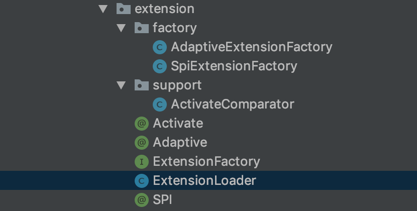
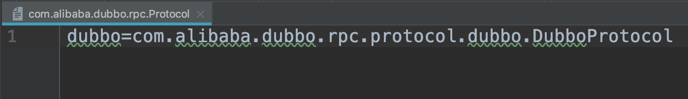
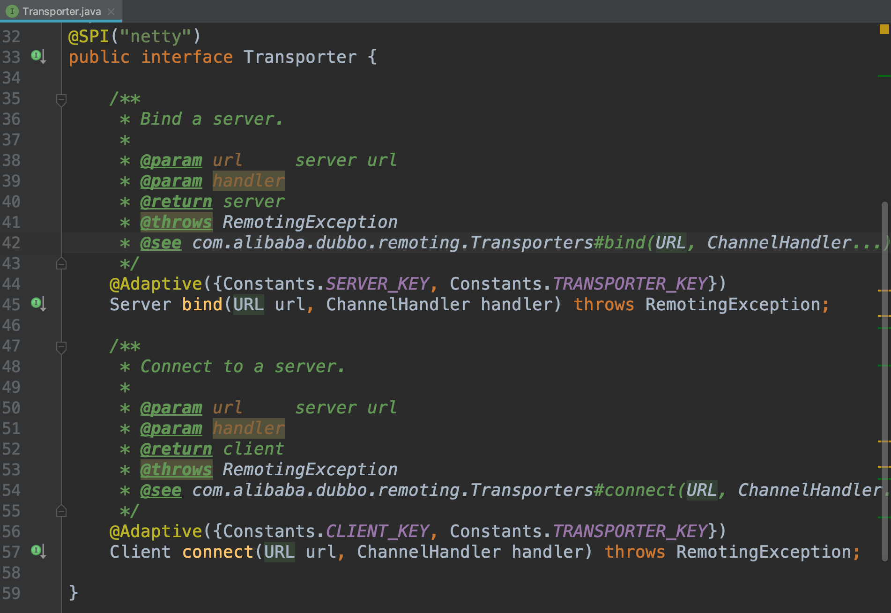
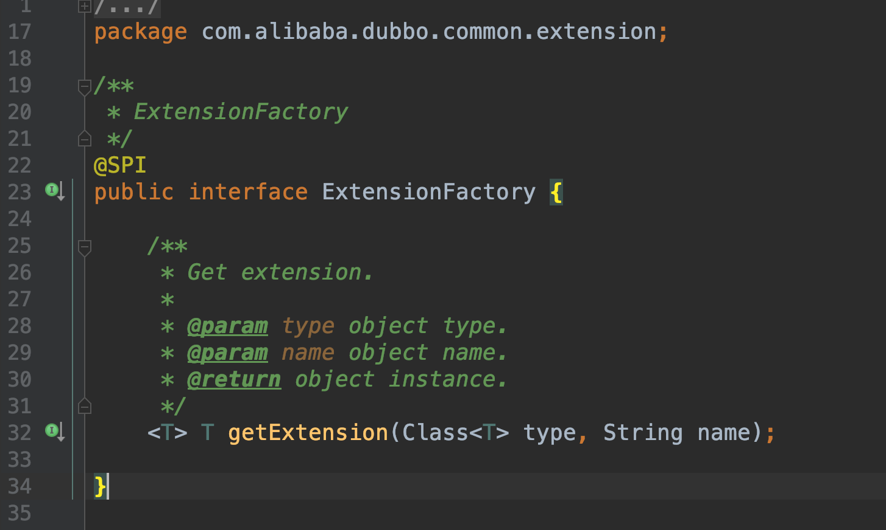

前一篇文章是对 Dubbo 整个项目大体的介绍，而从这篇文章开始，我将会从源码来解读 Dubbo 在各个模块的实现原理以及特点，由于全部由截图的方式去解读源码会导致文章很杂乱，所以我只会放部分截图，全部的解读会同步更新在我 Github 上 Fork 的 Dubbo 源码中，同时我也会在文章一些关键的地方加上超链接，方便读者快速查阅。
我会在之后的每篇文章前都写一个目标，为了让读者一眼就能知道本文是否是你需要寻找的资料。
目标：让读者知道 JDK 的 SPI 思想，Dubbo 的 SPI 思想，Dubbo 扩展机制 SPI 的原理，能够读懂实现扩展机制的源码。
第一篇源码分析的文章就先来讲讲 Dubbo 扩展机制 SPI 的原理，浏览过 Dubbo 官方文档的朋友肯定知道，Dubbo 有大量的 SPI 扩展实现，包括协议扩展、调用拦截扩展、路由扩展等 26 个扩展，并且 SPI 机制运用到了各个模块的设计中。
所以我打算先讲解 Dubbo 的扩展机制 SPI。

JDK 的 SPI 思想
SPI 的全称为 Service Provider Interface，面向对象的设计里面，模块之间推荐基于接口编程，而不是对实现类进行硬编码，这样做也是为了模块设计的可拔插原则。
为了在模块装配的时候不在程序里指明是哪个实现，就需要一种服务发现的机制，JDK 的 SPI 就是为某个接口寻找服务实现。
JDK 提供了服务实现查找的工具类：java.util.ServiceLoader，它会去加载 META-INF/service/ 目录下的配置文件。
具体的内部实现逻辑为这里先不展开，主要还是讲解 Dubbo 关于 SPI 的实现原理。

Dubbo 的 SPI 扩展机制原理
Dubbo 自己实现了一套 SPI 机制，改进了 JDK 标准的 SPI 机制：
1.JDK 标准的 SPI 只能通过遍历来查找扩展点和实例化，有可能导致一次性加载所有的扩展点，如果不是所有的扩展点都被用到，就会导致资源的浪费。
  Dubbo 每个扩展点都有多种实现，例如：org.apache.dubbo.rpc.Protocol 接口有 InjvmProtocol、DubboProtocol、RmiProtocol、HttpProtocol、HessianProtocol 等实现，如果只是用到其中一个实现，可是加载了全部的实现，会导致资源的浪费。
2.把配置文件中扩展实现的格式修改，例如：META-INF/dubbo/com.xxx.Protocol 里的 com.foo.XxxProtocol 格式改为了 xxx = com.foo.XxxProtocol 这种以键值对的形式，这样做的目的是为了让我们更容易的定位到问题，比如由于第三方库不存在，无法初始化，导致无法加载扩展名("A")，当用户配置使用 A 时，Dubbo 就会报无法加载扩展名的错误，而不是报哪些扩展名的实现加载失败以及错误原因，这是因为原来的配置格式没有把扩展名的 Id 记录，导致 Dubbo 无法抛出较为精准的异常，这会加大排查问题的难度。
  所以改成 key-value 的形式来进行配置。
3.Dubbo 的 SPI 机制增加了对 IOC、AOP 的支持，一个扩展点可以直接通过 setter 注入到其他扩展点。

我们先来看看 SPI 扩展机制实现的结构目录：

1.@SPI
  在某个接口上加上 @SPI 注解后，表明该接口为可扩展接口。
  我用协议扩展接口 Protocol 来举例子，如果使用者在<dubbo:protocol/>、<dubbo:service/>、<dubbo:reference/>都没有指定 protocol 属性的话，那么就会默认 DubboProtocol 就是接口 Protocol，因为在 Protocol 上有 @SPI("dubbo) 注解。
  而这个 protocol 属性值或者默认值会被当作该接口的实现类中的一个 key，Dubbo 会去 META-INF.dubbo.internal\org.apache.dubbo.rpc.Protocol 文件中找该 key 对应的 value，看下图：
  
  value 就是该 Protocol 接口的实现类 DubboProtocol，这样就做到了 SPI 扩展。
2.@Adaptive
  该注解为了保证 Dubbo 在内部调用具体实现的时候不是硬编码来指定引用哪个实现，也就是为了适配一个接口的多种实现，这样做符合模块接口设计的可插拔原则，也增加了整个框架的灵活性，该注解也实现了扩展点自动装配的特性。
  Dubbo 提供了两种方式来实现接口的适配器：
  2.1.在实现类上面加上 @Adaptive 注解，表明该实现类是该接口的适配器。
    举个例子 Dubbo 中的 ExtensionFactory 接口就有一个实现类 AdaptiveExtensionFactory，加了 @Adaptive 注解，AdaptiveExtensionFactory 就不提供具体业务支持，用来适配 ExtensionFactory 的 SpiExtensionFactory 和 SpringExtensionFactory 这两种实现。
    AdaptiveExtensionFactory 会根据在运行时的一些状态来选择具体调用 ExtensionFactory 的哪个实现，具体的选择可以看下文 Adaptive 的代码解析。
  2.2.在接口方法上加 @Adaptive 注解，Dubbo 会动态生成适配器类。
    我们从 Transporter 接口的源码来解释这种方法：
    
    我们可以看到在这个接口的 bind 和 connect 方法上都有 @Adaptive 注解，有该注解的方法的参数必须包含 URL，ExtensionLoader 会通过 createAdaptiveExtensionClassCode() 动态生成一个 Transporter$Adaptive 类，生成的代码如下：
~~~java
package com.alibaba.dubbo.remoting;
import com.alibaba.dubbo.common.extension.ExtensionLoader;
public class Transporter$Adaptive implements com.alibaba.dubbo.remoting.Transporter{
    public com.alibaba.dubbo.remoting.Client connect(com.alibaba.dubbo.common.URL arg0, com.alibaba.dubbo.remoting.ChannelHandler arg1) throws com.alibaba.dubbo.remoting.RemotingException {
        // URL 参数为空则抛出异常
        if (arg0 == null)
            throw new IllegalArgumentException("url == null");
        com.alibaba.dubbo.common.URL url = arg0;
        // 这里的 getParameter() 可以在源码中具体查看
        String extName = url.getParameter("client", url.getParameter("transporter", "netty"));
        if(extName == null)
            throw new IllegalStateException("Fail to get extension(com.alibaba.dubbo.remoting.Transporter) name from url(" + url.toString() + ") use keys([client, transporter])");
        // 这里我在后面会有详细介绍
        com.alibaba.dubbo.remoting.Transporter extension = (com.alibaba.dubbo.remoting.Transporter)ExtensionLoader.getExtensionLoader(com.alibaba.dubbo.remoting.Transporter.class).getExtension(extName);
        return extension.connect(arg0, arg1);
    }
    public com.alibaba.dubbo.remoting.Server bind(com.alibaba.dubbo.common.URL arg0, com.alibaba.dubbo.remoting.ChannelHandler arg1) throws com.alibaba.dubbo.remoting.RemotingException {
        if (arg0 == null)
            throw new IllegalArgumentException("url == null");
        com.alibaba.dubbo.common.URL url = arg0;
        String extName = url.getParameter("server", url.getParameter("transporter", "netty"));
        if(extName == null)
            throw new IllegalStateException("Fail to get extension(com.alibaba.dubbo.remoting.Transporter) name from url(" + url.toString() + ") use keys([server, transporter])");
        com.alibaba.dubbo.remoting.Transporter extension = (com.alibaba.dubbo.remoting.Transporter)ExtensionLoader.getExtensionLoader(com.alibaba.dubbo.remoting.Transporter.class).getExtension(extName);
        return extension.bind(arg0, arg1);
    }
}
~~~
  2.3.可以看到该类的两个方法就是 Transporter 接口中有注解的两个方法，我来解释一下第一个方法 connect()。
    2.3.1.所有扩展点都通过传递 URL 携带配置信息，所以适配器中的方法必须携带 URL 参数，才能根据 URL 中的配置来选择对应的扩展实现。
    2.3.2.@Adaptive 注解中有一些 key 值，比如 connect() 的注解中有两个 key，分别为"client"和"transporter"，URL 会首先去取 client 对应的 value，如果为空，则去取 transporter 对应的 value，如果还是为空，则会根据 SPI 默认的 key，也就是 netty 去调用扩展的实现类，如果 @SPI 没有设定默认值，则会抛出 IllegalStateException 异常。
    这样就比较清楚这个适配器如何去选择哪个实现类作为本次需要调用的类，这里最关键的还是强调了 Dubbo 以 URL 为总线，运行过程中所有的状态数据信息都可以通过 URL 来获取，比如当前系统采用什么序列化、采用什么通信、采用什么负载均衡等信息，都是通过 URL 的参数来呈现的，所以在框架运行过程中，运行到某个阶段需要相应的数据，都可以通过对应的 Key 从 URL 的参数列表中获取。
3.@Activate
  扩展点自动激活加载的注解，就是用条件来控制该扩展点实现是否被自动激活加载，在扩展实现类上面使用，实现了扩展点自动激活的特性，它可以设置两个参数，分别是"group"和"value"。
4.ExtensionFactory 接口
  先来看看它的源码：
  
  该接口是扩展工厂接口类，它本身也是一个扩展接口，有 @SPI 注解。
  该工厂接口提供的就是获取实现类的实例，它也有两种扩展实现，分别是 SpiExtensionFactory 和 SpringExtensionFactory 代表着两种不同方式去获取实例。
  而具体选择哪种方式去获取实现类的实例，则在适配器 AdaptiveExtensionFactory 中制定了规则。
5.ExtensionLoader
  该类是扩展加载器，这是 Dubbo 实现 SPI 扩展机制的核心，几乎所有实现的逻辑都被封装在 ExtensionLoader 中。
  5.1.属性(选取关键属性进行展开讲解)
    5.1.1.关于存放配置文件的路径变量
    ```java
        private static final String SERVICES_DIRECTORY = "META-INF/services/";
        private static final String DUBBO_DIRECTORY = "META-INF/dubbo/";
        private static final String DUBBO_INTERNAL_DIRECTORY = DUBBO_DIRECTORY + "internal/";
    ```
      "META-INF/services/"、"META-INF/dubbo/"、"META-INF/dubbo/internal/"三个值，都是dubbo寻找扩展实现类的配置文件存放路径，也就是 @SPI 注解中讲到的以接口全限定名命名的配置文件存放的路径。
      区别在于"META-INF/services/"是 Dubbo 为了兼容 JDK 的 SPI 扩展机制思想而存在的，"META-INF/dubbo/internal/"是 Dubbo 内部提供的扩展的配置文件路径，而"META-INF/dubbo/"是为了给用户自定义的扩展实现配置文件存放。
    5.1.2.扩展加载器集合，key 为扩展接口，例如：Protocol 等：
    ```java
        private static final ConcurrentMap<Class<?>, ExtensionLoader<?>> EXTENSION_LOADERS = new ConcurrentHashMap<Class<?>, ExtensionLoader<?>>();
    ```
    5.1.3.扩展实现类集合，key 为扩展实现类，value 为扩展对象，例如：key 为 Class，value 为 DubboProtocol 对象。
    ```java
        private static final ConcurrentMap<Class<?>, Object> EXTENSION_INSTANCES = new ConcurrentHashMap<Class<?>, Object>();
    ```
    5.1.4.以下属性都是 cache 开头的，都是出于性能和资源的优化，才做的缓存，读取扩展配置后，会先进行缓存，等到真正需要用到某个实现时，再对该实现类的对象进行初始化，然后对该对象也进行缓存。
    ```java
        // 以下提到的扩展名就是在配置文件中的 key 值，类似于"dubbo"等
        // 缓存的扩展名与拓展类映射，和 cachedClasses 的 key 和 value 对换
        private final ConcurrentMap<Class<?>, String> cachedNames = new ConcurrentHashMap<>();
        // 缓存的扩展实现类集合
        private final Holder<Map<String, Class<?>>> cachedClasses = new Holder<>();
        // 扩展名与加有 @Activate 的自动激活类的映射
        private final Map<String, Object> cachedActivates = new ConcurrentHashMap<>();
        // 缓存的扩展对象集合，key 为扩展名，value 为扩展对象
        // 例如 Protocol 扩展，key 为 dubbo，value 为 DubboProcotol
        private final ConcurrentMap<String, Holder<Object>> cachedInstances = new ConcurrentHashMap<>();
        // 缓存的自适应(Adaptive)扩展对象，例如：AdaptiveExtensionFactory 类的对象
        private final Holder<Object> cachedAdaptiveInstance = new Holder<>();
        // 缓存的自适应扩展对象的类，例如：AdaptiveExtensionFactory 类
        private volatile Class<?> cachedAdaptiveClass = null;
        // 缓存的默认扩展名，就是 @SPI 中设置的值
        private String cachedDefaultName;
        // 创建 cachedAdaptiveInstance 异常
        private volatile Throwable createAdaptiveInstanceError;
        // 拓展 Wrapper 实现类集合
        private Set<Class<?>> cachedWrapperClasses;
        // 拓展名与加载对应拓展类发生的异常的映射
        private Map<String, IllegalStateException> exceptions = new ConcurrentHashMap<>();
    ```
      这里提到了 Wrapper 类的概念。
      那我就解释一下：Wrapper 类也实现了扩展接口，但是 Wrapper 类的用途是 ExtensionLoader 返回扩展点时，包装在真正的扩展点实现外，这实现了扩展点自动包装的特性。
      通俗点说，就是一个接口有很多的实现类，这些实现类会有一些公共的逻辑，如果在每个实现类写一遍这个公共逻辑，那么代码就会重复，所以增加了这个 Wrapper 类来包装，把公共逻辑写到 Wrapper 类中，有点类似 AOP 切面编程思想。
  5.2.getExtensionLoader(Class type)：根据扩展点接口来获得扩展加载器。
    ```java
        public static <T> ExtensionLoader<T> getExtensionLoader(Class<T> type) {
            // 扩展点接口为空，抛出异常
            if (type == null)
                throw new IllegalArgumentException("Extension type == null");
            // 判断type是否是一个接口类
            if (!type.isInterface())
                throw new IllegalArgumentException("Extension type(" + type + ") is not interface!");
            // 判断是否为可扩展的接口
            if (!withExtensionAnnotation(type))
                throw new IllegalArgumentException("Extension type(" + type + ") is not extension, because WITHOUT @" + SPI.class.getSimpleName() + " Annotation!");
            // 从扩展加载器集合中取出扩展接口对应的扩展加载器
            ExtensionLoader<T> loader = (ExtensionLoader<T>) EXTENSION_LOADERS.get(type);          
            // 如果为空，则创建该扩展接口的扩展加载器，并且添加到 EXTENSION_LOADERS
            if (loader == null) {
                EXTENSION_LOADERS.putIfAbsent(type, new ExtensionLoader<T>(type));
                loader = (ExtensionLoader<T>) EXTENSION_LOADERS.get(type);
            }
            return loader;
        }
    ```
  5.3.getActivateExtension()：获得符合自动激活条件的扩展实现类对象集合。
    ```java
        public List<T> getActivateExtension(URL url, String[] values, String group) {
            List<T> exts = new ArrayList<T>();
            List<String> names = values == null ? new ArrayList<String>(0) : Arrays.asList(values);
            // 判断不存在配置"-name"
            // 例如：<dubbo:service filter="-default"/>，代表移除所有默认过滤器
            if (!names.contains(Constants.REMOVE_VALUE_PREFIX + Constants.DEFAULT_KEY)) {
                // 获得扩展实现类数组，把扩展实现类放到 cachedClasses 中
                getExtensionClasses();
                for (Map.Entry<String, Activate> entry : cachedActivates.entrySet()) {
                    String name = entry.getKey();
                    Activate activate = entry.getValue();
                    // 判断 group 值是否存在所有自动激活类中 group 组中，匹配分组
                    if (isMatchGroup(group, activate.group())) {
                        // 通过扩展名获得拓展对象
                        T ext = getExtension(name);
                        // 不包含在自定义配置里，如果包含，会在下面的代码处理
                        // 判断是否配置移除，例如：<dubbo:service filter="-monitor"/>，则 MonitorFilter 会被移除
                        // 判断是否激活
                        if (!names.contains(name) && !names.contains(Constants.REMOVE_VALUE_PREFIX + name) && isActive(activate, url))
                            exts.add(ext);
                    }
                }
                // 排序
                Collections.sort(exts, ActivateComparator.COMPARATOR);
            }
            List<T> usrs = new ArrayList<T>();
            for (int i = 0; i < names.size(); i++) {
                String name = names.get(i);
                // 还是判断是否是被移除的配置
                if (!name.startsWith(Constants.REMOVE_VALUE_PREFIX) && !names.contains(Constants.REMOVE_VALUE_PREFIX + name)) {
                    // 在配置中把自定义的配置放在自动激活的扩展对象前面，可以让自定义的配置先加载
                    // 例如：<dubbo:service filter="demo,default,demo2"/>，则 DemoFilter 就会放在默认的过滤器前面
                    if (Constants.DEFAULT_KEY.equals(name)) {
                        if (!usrs.isEmpty()) {
                            exts.addAll(0, usrs);
                            usrs.clear();
                        } else {
                            T ext = getExtension(name);
                            usrs.add(ext);
                        }
                    }
                }
                if (!usrs.isEmpty()) {
                    exts.addAll(usrs);
                }
                return exts;
            }
        }
    ```
    getActivateExtension() 有几个关键点：
    5.3.1.group 的值合法判断，因为 group 可选"provider"或"consumer"。
    5.3.2.判断该配置是否被移除。
    5.3.3.如果有自定义配置，并且需要放在自动激活扩展实现对象加载前，那么需要先存放自定义配置。
  5.4.getExtension()：通过扩展名获得扩展对象。


  5.5.


6.AdaptiveExtensionFactory
  该类是 ExtensionFactory 的适配器类，也是 @Adaptive 注解中提到的第一种适配器类的使用。
  来看看该类的源码：
~~~java
@Adaptive
public class AdaptiveExtensionFactory implements ExtensionFactory {
    // 扩展对象的集合，默认的可以分为 Dubbo 的 SPI 中接口实现类对象或者 Spring Bean 对象
    private final List<ExtensionFactory> factories;
    
    public AdaptiveExtensionFactory() {
        ExtensionLoader<ExtensionFactory> loader = ExtensionLoader.getExtensionLoader(ExtensionFactory.class);
        List<ExtensionFactory> list = new ArrayList<ExtensionFactory>();
        // 遍历所有支持的扩展名
        for (String name : loader.getSupportedExtensions()) {
            // 扩展对象加入到集合中
            list.add(loader.getExtension(name));
        }
        // 返回一个不可修改的集合
        factories = Collections.unmodifiableList(list);
    }

    @Override
    public <T> T getExtension(Class<T> type, String name) {
        for (ExtensionFactory factory : factories) {
            // 通过扩展接口和扩展名获得扩展对象
            T extension = factory.getExtension(type, name);
            if (extension != null) {
                return extension;
            }
        }
        return null;
    }
}
~~~
  6.1.factories 是扩展对象的集合，当用户没有自己实现 ExtensionFactory 接口，则这个属性就只会有两种对象，分别是 SpiExtensionFactory 和 SpringExtensionFactory。
  6.2.构造器中是把所有支持的扩展名的扩展对象加入到集合。
  6.3.实现了接口的 getExtension()，通过接口和扩展名来获取扩展对象。
7.SpiExtensionFactory
  SpiExtensionFactory 拓展实现类，看看源码：
~~~java
public class SpiExtensionFactory implements ExtensionFactory {
    @Override
    public <T> T getExtension(Class<T> type, String name) {
        // 判断是否为接口，接口上是否有 @SPI 注解
        if (type.isInterface() && type.isAnnotationPresent(SPI.class)) {
            // 获得扩展加载器
            ExtensionLoader<T> loader = ExtensionLoader.getExtensionLoader(type);
            if (!loader.getSupportedExtensions().isEmpty()) {
                // 返回适配器类的对象
                return loader.getAdaptiveExtension();
            }
        }
    }
}
~~~
8.ActivateComparator


