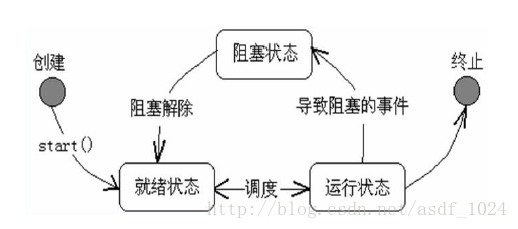

(1)新建 (2)就绪 (3)运行 (4)阻塞 (5)死亡

1.新建：创建线程对象后，该线程处于新建状态，此时它不能运行，和其他 Java 对象一样，仅仅由 Java 虚拟机为其分配了内存，没有表现出任何线程的动态特征。
2.就绪：当线程对象调用了 start() 后，该线程就进入了就绪状态，处于就绪状态的线程位于可运行池中，此时它只是具备了运行的条件，能否获得 CPU 的使用权开始运行，还需要等待系统的调度。
3.运行：处于就绪状态的线程获得了 CPU 使用权，开始执行 run() 中的线程执行体，此时线程处于运行状态，当一个线程启动后，它不能一直处于运行状态(除非它的线程执行体足够短，可以达到瞬间结束)，当使用完操作系统分配的时间片后，操作系统就会剥脱该线程所占用的 CPU 资源，以便让其他线程获得执行的机会。
4.阻塞：一个正在执行的线程在某些特殊情况下，如执行耗时的输入/输出操作时，会放弃 CPU 的使用权，进入阻塞状态，当线程进入阻塞状态后，就不能直接进入排队队列，只有当引起阻塞的原因，被消除后，线程才可以进入就绪状态。
  4.1.当线程试图获取某个对象的同步锁时，如果该锁被其他线程所持有，则当前线程进入阻塞状态，如果想从阻塞状态进入就绪状态必须得获取到其他线程所持有的锁。
  4.2.当线程调用了一个阻塞式的 IO 方法时，该线程就会进入阻塞状态，如果想进入就绪状态就必须要等到这个阻塞的 IO 方法返回。
  4.3.当线程调用了某个对象的 wait() 时，也会使线程进入阻塞状态，notify() 唤醒。
  4.4.调用了 Thread.sleep(long millis) 线程睡眠时间到了会自动进入就绪状态。
  4.5.一个线程调用了另一个线程的 join() 时，当前线程进入阻塞状态，等新加入的线程运行结束后会结束阻塞状态，进入就绪状态。
5.死亡：线程的 run() 正常执行完毕或者线程抛出一个未捕获的异常(Exception)、错误(Error)，线程就进入死亡状态，一旦进入死亡状态，线程将不再拥有运行的资格，也不能转换为其他状态。
