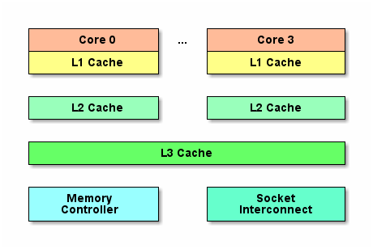

CPU 是计算机的大脑，它负责执行程序的指令，内存负责存数据，包括程序自身数据。
内存要比 CPU 慢很多，现在获取内存中的一条数据大概需要 200 多个 CPU 周期(CPU Cycles)，而 CPU 寄存器一般情况下只需要 1 个 CPU 周期就够了。
网页浏览器为了加快速度，会在本机缓存以前浏览过的数据；传统数据库或 NoSQL 数据库为了加速查询，常在内存中设置一个缓存，减少对磁盘(慢)的 IO。
同样内存与 CPU 的速度相差太远，于是 CPU 设计者们就给 CPU 加上了缓存(CPU Cache)。
如果需要对同一批数据操作很多次，那么把数据放至离 CPU 更近的缓存，会给程序带来很大的速度提升。
例如：做一个循环计数，把计数变量放到缓存里，就不用每次循环都往内存存取数据了。
下面是 CPU Cache 的简单示意图：

随着多核的发展，CPU Cache 分成了三个级别：L1、L2、L3。
级别越小越接近 CPU，所以速度也更快，同时也代表着容量越小。
L1 Cache 是最接近 CPU 的，它容量最小，例如 32K，速度最快，每个核上都有一个 L1 Cache(准确地说每个核上有两个 L1 Cache，一个存数据 L1d Cache，一个存指令 L1i Cache)。
L2 Cache 更大一些，例如 256K，速度要慢一些，一般情况下每个核上都有一个独立的 L2 Cache。
L3 Cache 是三级缓存中最大的一级，例如 12MB，同时也是最慢的一级，在同一个 CPU 插槽之间的核共享一个 L3 Cache。
就像数据库缓存一样，获取数据时首先会在最快的缓存中找数据，如果没有命中则往下一级找，直到三级缓存都找不到，那只有向内存要数据了。
一次次地未命中，代表获取数据所消耗的时间越长。
为了高效地存取缓存，不是简单随意地将单条数据写入缓存的。
缓存是由缓存行组成的，典型的一行是 64 个字节。
CPU 存取缓存都是按行为最小单位操作的。
Java long 型占 8 字节，所以从一条缓存行上可以获取到 8 个 long 型变量。
所以如果访问一个 long 型数组，当有一个 long 被加载到缓存中，将会无消耗地加载了另外 7 个，所以可以非常快地遍历数组。
既然典型的 CPU 微架构有 3 级缓存，每个核都有自己私有的 L1、L2 缓存，那么多线程编程时，另外一个核的线程想要访问当前核内 L1、L2 缓存行的数据，该怎么办呢？
有一种办法可以通过第 2 个核直接访问第 1 个核的缓存行。
这是可行的，但这种方法不够快。
跨核访问需要通过 Memory Controller，典型的情况是第 2 个核经常访问第 1 个核的这条数据，那么每次都有跨核的消耗。
更糟的情况是，有可能第 2 个核与第 1 个核不在一个插槽内，况且 Memory Controller 的总线带宽是有限的，扛不住这么多的数据传输。
所以 CPU 的设计者们更偏向于另一种办法：如果第 2 个核需要这份数据，由第 1 个核直接把数据内容发送过去，数据只需要传一次。
那么什么时候会发生缓存行的传输呢？
答案很简单：当一个核需要读取另外一个核的脏缓存行时发生。
但是前者怎么判断后者的缓存行已经被弄脏(写)了呢？
下面将详细地解答以上问题。
首先需要谈到一个协议 MESI 协议。
现在主流的处理器都是用它来保证缓存的相干性和内存的相干性。
M、E、S、I 代表使用 MESI 协议时缓存行所处的四个状态：
1.M(Modified，修改)：本地处理器已经修改缓存行，即是脏行，它的内容与内存中的内容不一样，并且此 Cache 只有本地一个拷贝(专有)。
2.E(Exclusive，专有)：缓存行内容和内存中的一样，而且其它处理器都没有这行数据。
3.S(Shared，共享)：缓存行内容和内存中的一样，有可能其它处理器也存在此缓存行的拷贝。
4.I(Invalid，无效)：缓存行失效，不能使用。
下面简单地说明下缓存行的四种状态是怎么转换的：
1.初始：一开始时，缓存行没有加载任何数据，所以它处于 I 状态。
2.本地写(Local Write)：如果本地处理器写数据至处于 I 状态的缓存行，则缓存行的状态变成 M。
3.本地读(Local Read)：如果本地处理器读取处于 I 状态的缓存行，很明显此缓存没有数据给它，此时分两种情况。
  3.1.其它处理器的缓存里也没有此行数据，则从内存加载数据到此缓存行后，再将它设成 E 状态，表示只有我一家有这条数据，其它处理器都没有。
  3.2.其它处理器的缓存里有此行数据，则将此缓存行的状态设为 S 状态。
  P.S.如果处于 M 状态的缓存行，再由本地处理器写入/读出，状态是不会改变的。
4.远程读(Remote Read)：假设有两个处理器 C1 和 C2，如果 C2 需要读另外一个处理器 C1 的缓存行内容，C1 需要把它缓存行的内容通过内存控制器(Memory Controller)发送给 C2，C2 接到后将相应的缓存行状态设为 S(在设置之前内存需要从总线上得到这份数据并保存起来)。
5.远程写(Remote Write)：其实确切地说不是远程写，而是 C2 得到 C1 的数据后，不是为了读，而是为了写，也算是本地写，只是 C1 也拥有这份数据的拷贝，这该怎么办呢？
  5.1.C2 将发出一个 RFO (Request For Owner)请求，它需要拥有这行数据的权限，其它处理器的相应缓存行设为 I，除了它自已，谁都不能动这行数据。
  5.2.这样才能保证数据的安全，同时处理 RFO 请求以及设置 I 的过程将给写操作带来很大的性能消耗。
从上述内容可知，写操作的代价很高，特别当需要发送 RFO 消息时。
那编写程序时，什么时候会发生 RFO 请求呢？
有以下两种：
1.线程的工作从一个处理器移到另一个处理器，它操作的所有缓存行都需要移到新的处理器上，此后如果再写缓存行，则此缓存行在不同核上有多个拷贝，需要发送 RFO 请求。
2.两个不同的处理器确实都需要操作相同的缓存行。
在 Java 程序中，数组的成员在缓存中也是连续的。
同理 Java 对象的相邻成员变量也会加载到同一缓存行中。
如果多个线程操作不同的成员变量，但是相同的缓存行，伪共享(False Sharing)问题就发生了。
举个例子：一个运行在处理器 C1 上的线程想要更新变量 X 的值，同时另外一个运行在处理器 C2 上的线程想要更新变量 Y 的值。
但是，这两个频繁改动的变量都处于同一条缓存行。
两个线程就会轮番发送 RFO 消息，占得此缓存行的拥有权。
当 C1 取得了拥有权开始更新 X，则 C2 对应的缓存行需要设为 I 状态。
当 C2 取得了拥有权开始更新 Y，则 C1 对应的缓存行需要设为 I 状态。
轮番夺取拥有权不但带来大量的 RFO 消息，而且如果某个线程需要读此行数据时，L1 和 L2 缓存上都是失效的数据，只有 L3 缓存上是同步好的数据。
读 L3 的数据非常影响性能，更坏的情况是跨槽读取，L3 都要 Miss，只能从内存上加载。
表面上 X 和 Y 都是被独立线程操作的，而且两者之间的操作也没有任何关系。
只不过它们共享了一个缓存行，但所有竞争冲突都是来源于共享。
那么怎么避免伪共享呢？
一条缓存行有 64 个字节，而 Java 程序的对象头固定占 8 个字节(32 Bit OS)或 12 个字节(64 Bit OS 默认开启压缩，不开压缩为 16 个字节)。
只需要填 6 个无用的长整型补上 6*8=48 字节，让不同的变量处于不同的缓存行，就可以避免伪共享了(64 Bit OS 超过缓存行的 64 字节也无所谓，只要保证不同线程不要操作同一缓存行就可以)，这个办法叫做补齐(Padding)。
例如：
public final static class VolatileLong {
    public volatile long value = 0L;
    public long p1, p2, p3, p4, p5, p6;
}
伪共享在多核编程中很容易发生，而且比较隐蔽。
例如在 JDK 的 LinkedBlockingQueue 中，存在指向队列头的引用 head 和指向队列尾的引用 last。
而这种队列经常在异步编程中使有，这两个引用的值经常的被不同的线程修改，但它们却很可能在同一个缓存行，于是就产生了伪共享。
线程越多，核越多，对性能产生的负面效果就越大。
某些 Java 编译器会将没有使用到的补齐数据，即使示例代码中的 6 个长整型在编译时优化掉，可以在程序中加入一些代码防止被编译器优化掉。
public static long preventFromOptimization(VolatileLong v) {
    return v.p1 + v.p2 + v.p3 + v.p4 + v.p5 + v.p6;
}
另外，由于 Java 的 GC 问题。
数据在内存和对应的 CPU 缓存行的位置有可能发生变化，所以在使用补齐的时候应该注意 GC 的影响。
