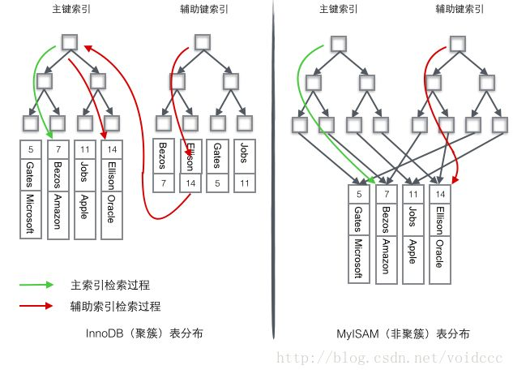

本篇介绍下 MySQL 的 InnoDB 索引相关知识，从各种树到索引原理到存储的细节。
InnoDB 是 MySQL 的默认存储引擎(MySQL 5.5.5 之前是 MyISAM)。
本着高效学习的目的，本篇以介绍 InnoDB 为主，少量涉及 MyISAM 作为对比。
这篇文章是我在学习过程中总结完成的，内容主要来自书本和博客，过程中加入了一些自己的理解，描述不准确的地方烦请指出。

各种树形结构
本来不打算从二叉搜索树开始，因为网上已经有太多相关文章，但是考虑到清晰的图示对理解问题有很大帮助，也为了保证文章完整性，最后还是加上了这部分。
先看看几种树形结构：
1.搜索二叉树：每个节点有两个子节点，数据量的增大必然导致高度的快速增加，显然这个不适合作为大量数据存储的基础结构。
2.B 树：一棵 m 阶 B 树是一棵平衡的 m 路搜索树。
  最重要的性质是每个非根节点所包含的关键字个数 j 满足：(m/2) - 1 <= j <= m - 1，一个节点的子节点数量会比关键字个数多 1，这样关键字就变成了子节点的分割标志。
  一般会在图示中把关键字画到子节点中间，非常形象，也容易和后面的 B+ 树区分。
  由于数据同时存在于叶子节点和非叶子结点中，无法简单完成按顺序遍历 B 树中的关键字，必须用中序遍历的方法。
3.B+ 树：一棵 m 阶 B 树是一棵平衡的 m 路搜索树。
  最重要的性质是每个非根节点所包含的关键字个数 j 满足：(m/2) - 1 <= j <= m，子树的个数最多可以与关键字一样多。
  非叶节点存储的是子树里最小的关键字。
  同时数据节点只存在于叶子节点中，且叶子节点间增加了横向的指针，这样顺序遍历所有数据将变得非常容易。
4.B* 树：一棵 m 阶 B 树是一棵平衡的 m 路搜索树。
  最重要的两个性质是，每个非根节点所包含的关键字个数 j 满足：(m2/3) - 1 <= j <= m；非根节点间添加了横向指针。

B+ 树适合作为数据库的基础结构，完全是因为计算机的内存-机械硬盘两层存储结构。
内存可以完成快速的随机访问(随机访问即给出任意一个地址，要求返回这个地址存储的数据)但是容量较小。
而硬盘的随机访问要经过机械动作(磁头移动、盘片转动)，访问效率比内存低几个数量级，但是硬盘容量较大。
典型的数据库容量大大超过可用内存大小，这就决定了在 B+ 树中检索一条数据很可能要借助几次磁盘 IO 操作来完成。
真实数据库中的 B+ 树应该是非常扁平的，可以通过向表中顺序插入足够多的数据的方式来验证 InnoDB 中的 B+ 树到底有多扁平。
通过统计数据可以分析出几个直观的结论，这几个结论宏观的展现了数据库里 B+ 树的尺度。
1.每个叶子节点存储了 468 行数据，每个非叶子节点存储了大约 1200 个键值，这是一棵平衡的 1200 路搜索树！
2.对于一个 22.1G 容量的表，也只需要高度为 3 的 B+ 树就能存储了，这个容量大概能满足很多应用的需要了，如果把高度增大到 4，则 B+ 树的存储容量立刻增大到 25.9T 之巨！
3.对于一个 22.1G 容量的表，B+ 树的高度是 3，如果要把非叶节点全部加载到内存也只需要少于 18.8M 的内存，只使用如此少的内存就可以保证只需要一次磁盘 IO 操作就检索出所需的数据，效率是非常之高的。

MySQL 的存储引擎和索引
可以说数据库必须有索引，没有索引则检索过程变成了顺序查找，O(n)的时间复杂度几乎是不能忍受的。
我们非常容易想象出一个只有单关键字组成的表如何使用 B+ 树进行索引，只要将关键字存储到树的节点即可。
当数据库一条记录里包含多个字段时，一棵 B+ 树就只能存储主键，如果检索的是非主键字段，则主键索引失去作用，又变成顺序查找了。
这时应该在第二个要检索的列上建立第二套索引。
1.InnoDB 使用的是聚簇索引，将主键组织到一棵 B+ 树中，而行数据就储存在叶子节点上，若使用"where id = 1"这样的条件查找数据，则按照 B+ 树的检索算法即可查找到对应的叶节点，之后获得行数据。
  若对 Name 列进行条件搜索，则需要两个步骤：
  1.1.第一步在辅助索引 B+ 树中检索 Name，到达其叶子节点获取对应的主键。
  1.2.第二步使用主键在主索引 B+ 树种再执行一次 B+ 树检索操作，最终到达叶子节点即可获取整行数据。
2.MyISAM 使用的是非聚簇索引，非聚簇索引的两棵 B+ 树看上去没什么不同，节点的结构完全一致只是存储的内容不同而已，主键索引 B+ 树的节点存储了主键，辅助键索引 B+ 树存储了辅助键。
  表数据存储在独立的地方，这两颗 B+ 树的叶子节点都使用一个地址指向真正的表数据，对于表数据来说，这两个键没有任何差别。
  由于索引树是独立的，通过辅助键检索无需访问主键的索引树。
  为了更形象说明这两种索引的区别，我们假想一个表存储了 4 行数据。
  其中 Id 作为主索引，Name 作为辅助索引。
  
